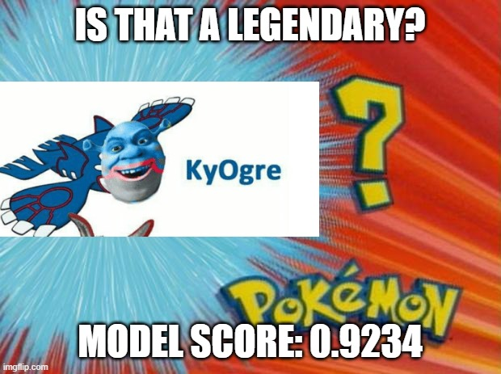

# Legendary Pokemon Classifier
> Binary classification model for identifying Legendary Pokemon

## Table of contents
---
* [Introduction](#introduction)
* [Methodology](#methodology)
* [Setup](#setup)
* [Future releases](#future-releases)
* [Resources](#resources)
* [Developer contact](#developer-contact)

## Introduction
---
 
### Purpose

The purpose of this repo is to apply simple binary classification models to a Pokemon dataset to help classify Legendary Pokemon.

### Brief

Did you ~~have a nice childhood~~ grow up in the late 90s or early 2000s? If so, you've probably heard of Pokemon. Odds are, you're familiar with popular Pokemon like Pikachu, Charizard or Mewtwo. 

Fun fact: there are currently 898 Pokemon. Of those, only 59 are labeled as being **Legendary**. Don't know what is a Legendary Pokemon? Imagine them as the "Alpha-Chad's" of the Poke-world. 

We thought it would be fun to train a machine to identify these apex type Pokemon. Said another way, what features are most significant in determining whether or not a Pokemon is Legendary?

## Methodology
---

### Getting the data
TBD...

### Data prep & modelling
TBD...

## Setup
---
### Setting up
To run this app on your own, either `fork` this repository, or `git clone` into your local. 

### Requirements
TBD...

### Getting the data
TBD...

## Future releases
---
          
## Resources
---
* Miro board [link](https://miro.com/welcomeonboard/OWgwMlFyU0wxaFppcjE5M1Rzd1Q4dzRtdDdwTGVjaUhUTkFnd05xVEVZZnA2MmltWVp2ZnVZaEcySkpEODlibnwzMDc0NDU3MzYzNDM4NzgzNzY1?invite_link_id=711569501319)
* Kaggle dataset [link](https://www.kaggle.com/swashbuckler1/pokemon-gen1gen8)

## Developer contact
---
* [Domenic Fayad](https://www.fullstaxx.com/)
* [Gavin He](https://gavh3.github.io/)
* [Nitish Kumar](https://github.com/nkumar97)
* [Shannon Lo](https://shannonhlo.github.io/)
